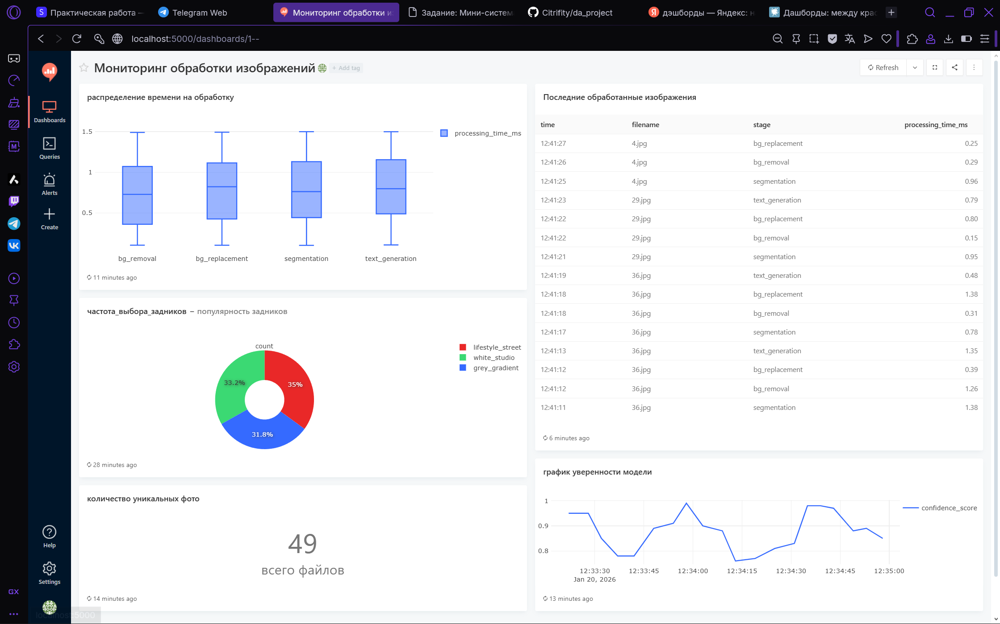

### Система по мониторингу обработки изображений
Упрощенная модель системы для подготовки карточек товаров на маркетплейсах с помощью компьютерного зрения.
За основу взята моя тема курсовой работы: «Автоматизация подготовки карточек товаров маркетплейса с применением компьютерного зрения». Генератор имитирует логи работы системы, которая выполняет следующие задачи из требований:
- Сегментация и выделение товара на фото.
- Замена фона на студийный (белый, серый и др.).
- Генерация текстовых описаний товаров в разных стилях.

Генератор имитирует работу, записывая этапы обработки (segmentation, bg_removal, bg_replacement, text_generation) в базу данных для последующего анализа.
##### Структура проекта
- generator/ — Python-скрипт, который имитирует обработку изображений и отправляет данные в БД.
- images/ — папка с исходными изображениями для обработки.
- docker-compose.yml — файл для запуска всей системы (БД, генератор, Redash).

Для запуска нужно:
- Положить несколько изображений в формате .jpg или .png в папку images.
- Выполнить команду в терминале: `docker-compose up`
- После чего вся система запустится автоматически.

